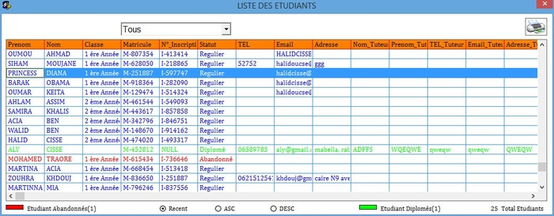

Gestion Inscription
======

eStation is a school management software made during my first year at university in 2014.

[Report PDF](./doc/Rapport.pdf)

[Download Installer](./doc/setup.msi)

## Interface

